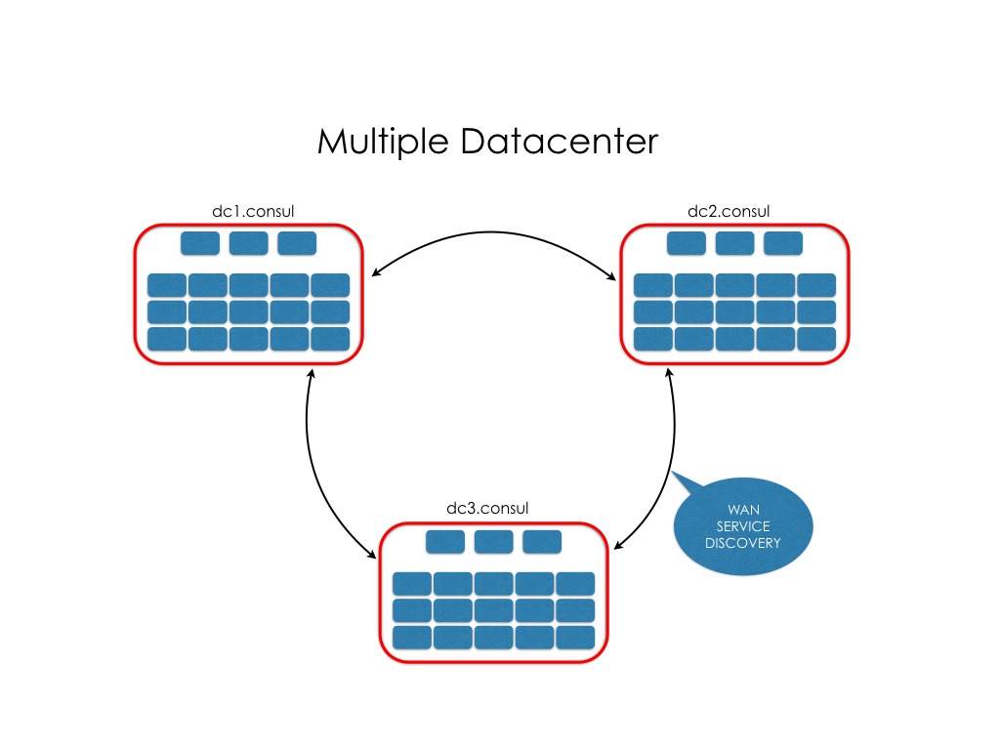

Overview
--------
Microservices infrastructure is a modern platform for rapidly deploying globally distributed services

##Features

* [Mesos](http://mesos.apache.org) cluser manager for efficient resource isolation and sharing across distributed services
* [Marathon](https://mesosphere.github.io/marathon) for cluster management of long running containerized services
* [Consul](http://consul.io) for service discovery 
* [Docker](http://docker.io) container runtime
* Multi-datacenter support
* High Availablility


####Architecture
The base platform contains control nodes that manage the cluster and any number of compute nodes. Containers automatically register themselves into DNS so that other services can locate them.


Once WAN joining is configured, each cluster can locate services in other data centers via DNS or the [Consul API](http://www.consul.io/docs/agent/http.html). 



####Control Nodes

The control nodes manage a single datacenter.  Each control node runs Consul for service discovery, Mesos leaders for resource scheduling and Mesos frameworks like Marathon. 

In general, it's best to provision 3 or 5 control nodes to achieve higher availability of services. The Consul Ansible role will automatically bootstrap and join multiple Consul nodes. The Mesos Ansible role will provision highly-availabile Mesos and ZooKeeper environments when more than one node is provisioned. 


####Compute Nodes

The compute nodes launch containers and other Mesos-based workloads. [Registrator](https://github.com/gliderlabs/registrator) is used to update Consul as containers are launched and exit. 


##Getting Started

A Vagrantfile is provided that provisions everything on a single VM. To run (ensure that your sytem has 4GB or RAM free):

```
	vagrant up
```


The [Getting Started Guide](https://microservices-infrastructure.readthedocs.org/en/latest/getting_started/index.html) covers multi-server and OpenStack deployments.


##Documentation
All documentation is located at [https://microservices-infrastructure.readthedocs.org](https://microservices-infrastructure.readthedocs.org/en/latest). 

To build the documentation locally, run:

```
	sudo pip install -r requirements.txt
	cd docs
	make html

```

License
-------
Copyright © 2015 Cisco Systems, Inc. All rights reserved. 

Released under the Apache 2.0 License. See LICENSE.
