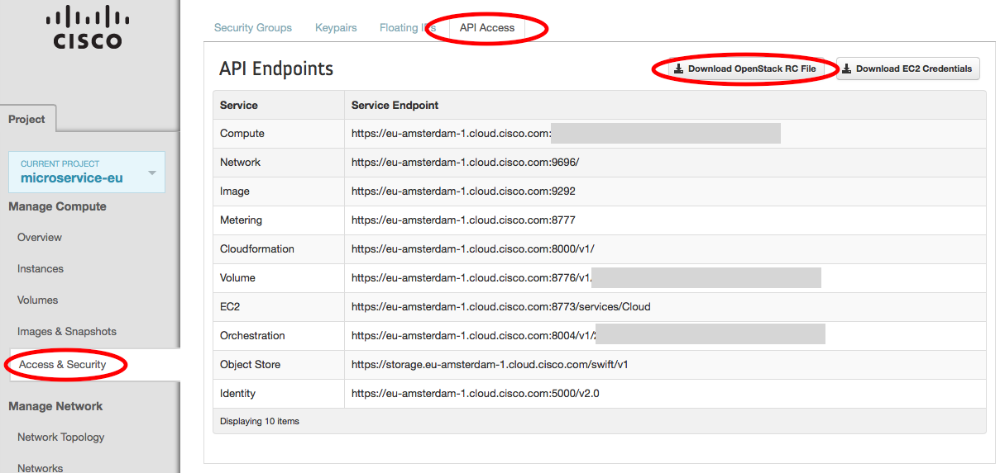

# OpenStack

Mantl uses Terraform to provision hosts in OpenStack. You can [download
Terraform from terraform.io](https://www.terraform.io/downloads.html).

This project provides a number of playbooks designed for doing host
maintenance tasks on OpenStack hosts. You can find them in `playbooks/`
in the main project directory.

## Configuring OpenStack authentication

Before we can build any servers using Terraform and Ansible, we need to
configure authentication. We'll be filling in the authentication
variables for the template located at
`terraform/openstack-modules.sample.tf`. It looks like this:

Copy that file in it's entirety to the root of the project to start
customization. NOTE: All configuration entries needs to be completed. In
the next sections, we'll explain how to obtain these settings.

You can also use this file as a base for further customization. For
example, you can change the names of the modules to be specific to your
environment. While we will explore the authentication variables in the
next sections, you will need to provide the `region`, `flavor_name`, and
other such variables yourself. You can get these variables from the
OpenStack command line tools. For example:

  - `glance image-list` for `image_name`
  - `keystone tenant-list` for `tenant_id` and `tenant_name`
  - `nova flavor-list` for `control_flavor_name` and
    `worker_flavor_name`

Or use the appropriate OpenStack commands such as `openstack project
list` or the commands below.

  - `openstack image list` for `image_name`
  - `openstack network list` for `net_id`
  - `openstack flavor list` for `control_flavor_name /
    worker_flavor_name`

### Generate SSH keys

If you do not have ssh keys already, generate a new pair for use with
the project. You need to add the path to this key (public\_key) to the
openstack.tf file.

``` sourceCode shell
ssh-keygen -t rsa -f /path/to/project/sshkey -C "sshkey"
```

### Getting OpenStack tenant settings

`auth_url`, `tenant_name`, and `tenant_id` are unique for each OpenStack
datacenter. You can get these from the OpenStack web console:

1.  Log Into the OpenStack web console and in the Manage Compute
    section, select "Access & Security".
2.  Select the "API Access" tab.
3.  Click on the "Download the OpenStack RC File" button. We'll use this
    file to set up authentication.
4.  Download the RC file for each Data Center you want to provision
    servers in. You may have to log into different OpenStack web
    consoles.



Open the file that you just downloaded. We are interested in three of
the environment variables that are exported:

``` sourceCode shell
export OS_AUTH_URL=https://my.openstack.com:5000/v2.0
export OS_TENANT_ID=my-long-unique-id
export OS_TENANT_NAME="my-project"
```

Update your Terraform file with these values for the appropriate fields,
and save the downloaded file for using the maintenance playbooks (you'll
just need to source the environment variables into your shell.)

### OpenStack Security Group

In order for terraform to apply correctly, you need to create a security
group in openstack for Mantl.

You can either login to the Web UI to perform this task or use the
openstack commmand line interface as below.

``` sourceCode shell
openstack security group create <group_name>
```

Once your group is created, ensure you update the openstack.tf file
accordingly.

### OpenStack Username/Password

The playbooks get Username/Password information via environment
variables:

Before running terraform or any playbooks, run the following command to
to pull in your username and password for Ansible to use, changing the
file name and location to the location of your OpenStack RC file:

``` sourceCode shell
source ~/Downloads/my-project.rc
```

> **note**
> 
>   - The default OpenStack RC file will prompt for your password in
>     order  
>     to set OS\_PASSWORD.

Once you're all set up there, run `terraform get` to prepare Terraform
to provision your cluster, `terraform plan` to see what will be created,
and `terraform apply` to provision the cluster. Afterwards, you can use
the instructions in getting started \<index\> to install Mantl on your
new cluster.

